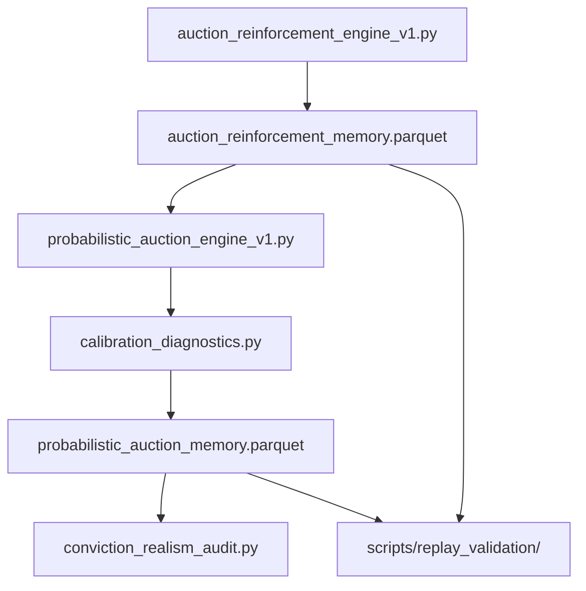

# CALIBRATION FRAMEWORK

**Status:** Phase 1A — diagnostics and observability only  
**Updated:** 2026-05-27  
**Behavioral logic:** Frozen — no threshold, weight, or suppression changes

---

## 1. Purpose

Phase 1A establishes a **calibration observability layer** on top of the existing probabilistic runtime. The goal is to diagnose whether conviction behaves probabilistically or exhibits structural overconfidence **before** any calibration changes.

This framework is intentionally passive:

- Runtime continues to use `conviction_probability` / `raw_conviction`
- Sigmoid calibration is exported but not applied
- Saturation, persistence, and conflict metrics are exported but do not alter belief math

---

## 2. Architecture



---

## 3. Diagnostic Layers

| Layer | Module | Output |
|-------|--------|--------|
| Decomposition (Phase 0B) | engines | component fields per row |
| Saturation | `calibration_diagnostics.py` | saturation_score, acceleration, monoculture |
| Persistence survival | `calibration_diagnostics.py` | duration, half-life, decay rates |
| Conflict density | `calibration_diagnostics.py` | conflict_density, flags, clusters |
| Sigmoid wrapper | `calibration_diagnostics.py` | raw_conviction, calibrated_conviction |
| Realism audit | `conviction_realism_audit.py` | `docs/CONVICTION_REALISM_AUDIT.md` |
| Replay validation | `scripts/replay_validation/` | temporal observability reports |

---

## 4. Saturation Diagnostics

| Metric | Definition |
|--------|------------|
| `saturation_score` | Proximity to conviction ceiling: `max(0, (raw - 0.5) / 0.5)` capped at 1 |
| `reinforcement_acceleration` | Delta of `reinforcement_component` vs prior row |
| `conviction_entropy_ratio` | `raw_conviction / entropy_penalty` |
| `alignment_monoculture_score` | Mode share of recent alignment_component values |

### Detection flags (export-only)

| Flag | Condition |
|------|-----------|
| `conviction_saturated` | raw_conviction > 0.90 |
| `conviction_saturated_persistence` | consecutive saturated rows |
| `repeated_high_conviction` | ≥4 HIGH_CONVICTION beliefs in reinforcement window |
| `runaway_reinforcement` | monotonic reinforcement_component increase over 5 steps |
| `entropy_suppression_failure` | high conviction + low entropy penalty |

---

## 5. Sigmoid Calibration Wrapper (Passive)

```python
calibrated_conviction = 1 / (1 + exp(-raw_conviction))
```

| Field | Role |
|-------|------|
| `raw_conviction` | Exact runtime conviction used by probabilistic engine |
| `conviction_probability` | Same value — preserved for backward compatibility |
| `calibrated_conviction` | Nonlinear diagnostic mapping — **not used at runtime** |

---

## 6. Persistence Survival Tracking

| Metric | Meaning |
|--------|---------|
| `persistence_duration` | Consecutive identical `auction_regime` values |
| `survival_half_life` | Estimated conviction decay half-life in tracked states |
| `continuation_decay_rate` | Mean negative conviction delta |
| `persistence_decay_velocity` | Delta of persistence_component |

### Tracked behavioral states

| Signal | Source |
|--------|--------|
| `HIGH_CONVICTION_AUCTION` | `auction_regime` |
| `LOCAL_EXHAUSTION` | `synthesis_state` |
| `STRUCTURAL_REVERSAL` | `synthesis_state` |
| `LOWER_ABSORPTION` | `location_bias` |

---

## 7. Conflict Density Engine

```text
conflict_density = conflicting_states / active_states
```

### Contradiction examples

| Flag | Condition |
|------|-----------|
| `continuation_plus_distribution` | high conviction + high distribution probability |
| `high_alignment_rising_entropy` | strong alignment multiplier + elevated entropy |
| `unfinished_auction_weak_persistence` | unfinished auction with weak persistence |
| `absorption_distribution_coexistence` | mixed reinforcement window signals |

Exports:

- `contradiction_flags` — pipe-delimited flag list
- `contradiction_clusters` — JSON cluster grouping

---

## 8. Verification & Replay

```bash
# Full Phase 1A verification
venv/bin/python3 scripts/verify_phase1_calibration.py

# Regenerate realism audit
venv/bin/python3 conviction_realism_audit.py

# Replay suite
venv/bin/python3 scripts/replay_validation/replay_runner.py
```

---

## 9. Explicit Non-Goals (Phase 1A)

- No threshold tuning
- No reinforcement math changes
- No entropy/conflict penalty application changes
- No execution or portfolio logic
- No ontology rewrite
- No production trading decisions

---

## 10. Next Phase (Planned)

Phase 1B+ will use this diagnostic layer to:

- evaluate sigmoid vs isotonic calibration candidates
- validate persistence half-life against replay evidence
- tune contradiction density before applying penalties

---

*See also: `docs/PROBABILISTIC_RUNTIME_MODEL.md`, `docs/CONVICTION_REALISM_AUDIT.md`*
