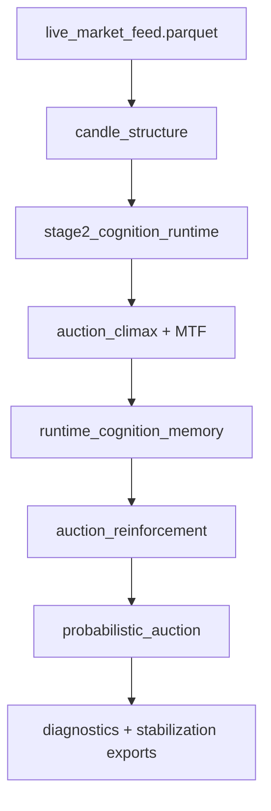

# FINAL RUNTIME TOPOLOGY

**Status:** Phase 4A — freeze candidate topology  
**Updated:** 2026-05-27

---

## 1. Canonical Pipeline (17 Steps)

| # | Engine | Mode |
|---|--------|------|
| 1 | `candle_structure_engine_v1.py` | subprocess |
| 2 | `volume_classification_engine_v1.py` | subprocess |
| 3 | `schema_validation_engine_v1.py` | subprocess (passthrough) |
| 4 | `behavioral_sequence_memory_v1.py` | subprocess |
| 5 | `behavioral_volume_observer_v1.py` | subprocess |
| 6 | `microstructure_candle_engine_v1.py` | subprocess |
| 7 | `volume_response_engine_v1.py` | subprocess |
| 8 | `climactic_behavior_engine_v1.py` | subprocess |
| 9 | `auction_convergence_engine_v1.py` | in-process |
| 10 | `auction_synthesis_engine_v1.py` | subprocess |
| 11 | `stage2_cognition_runtime_v1.py` | in-process |
| 12 | `runtime_cognition_engine_v1.py` | subprocess |
| 13 | `auction_reinforcement_engine_v1.py` | in-process |
| 14 | `probabilistic_auction_engine_v1.py` | in-process |
| 15 | `auction_decay_engine_v1.py` | subprocess |
| 16 | `state_transition_engine_v1.py` | subprocess |
| 17 | `adaptive_meta_cognition_engine_v1.py` | in-process |

Source of truth: `src/btc_ml/runtime/pipeline.py::CANONICAL_PIPELINE`

---

## 2. Observability Stack (Frozen)

| Phase | Layer | Export surface |
|-------|-------|----------------|
| 0B | Lineage / integrity | Parquet lineage columns |
| 1A | Calibration diagnostics | `calibration_diagnostics.py` |
| 1B | Probabilistic discipline | `calibration_discipline.py` |
| 2A | Regime + drift | `regime_segmentation.py`, `calibration_drift_engine.py` |
| 2B | Adversarial | `adversarial_diagnostics.py` |
| 3A | Ontology refinement | `ontology_refinement.py`, `post_event_evolution.py` |
| 3B | Stabilization | `ontology_stabilization.py` |
| 4A | Topology audit | `ontology_topology_audit.py` |

---

## 3. Ontology Topology Exports

| Field | Module |
|-------|--------|
| `ontology_topology_map` | `ontology_topology_audit.py` |
| `ontology_compression_zones` | `ontology_topology_audit.py` |
| `semantic_stability_index` | `ontology_topology_audit.py` |

---

## 4. Data Flow

---

*See also: `docs/CANONICAL_RUNTIME_MAP.md`, `docs/RUNTIME_FREEZE_CANDIDATE.md`*
