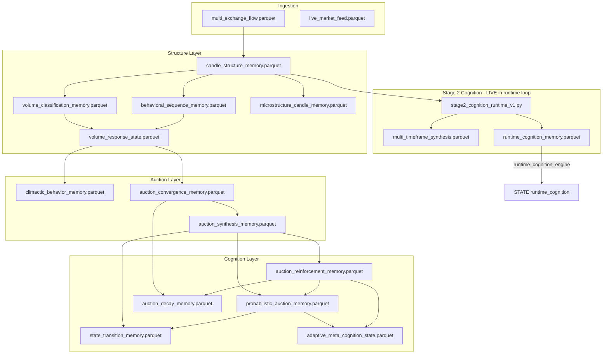

# PARQUET DEPENDENCY MAP

**Status:** Canonical reference (root repository)  
**Updated:** 2026-05-27 (Phase 0B integrity hardening applied)  
**Source tree:** Repository root (`/Users/fontecrypto/btc-ml`) — **canonical**  
**Deprecated mirror:** `btc-microstructure-engine/` — do not use for lineage

---

## Legend

| Symbol | Meaning |
|--------|---------|
| `→` | Data flows from producer to consumer |
| `[LIVE]` | Written during live runtime loop |
| `[BATCH]` | Written by batch/research job only |
| `[STATE]` | Loaded into `state_manager_v1.STATE` at import/refresh |
| `[GAP]` | Known wiring gap — not yet in canonical runtime loop |
| `[MIRROR]` | Legacy compatibility path kept in sync |

---

## 1. Canonical Production Lineage (Target)



---

## 2. Master Auction Runtime — Engine × Parquet Matrix

Orchestrator: **`master_auction_runtime_v1.py`** (canonical)

| # | Engine | Reads | Writes | Mode |
|---|--------|-------|--------|------|
| 1 | `candle_structure_engine_v1.py` | `multi_exchange_flow.parquet` | `candle_structure_memory.parquet` | `[LIVE]` |
| 2 | `volume_classification_engine_v1.py` | `candle_structure_memory.parquet` | `volume_classification_memory.parquet` | `[LIVE]` |
| 3 | `schema_validation_engine_v1.py` | *(in-memory / schema registry)* | — | `[LIVE]` |
| 4 | `behavioral_sequence_memory_v1.py` | `temporal_context_memory.parquet`, `volume_localization_v2_memory.parquet`, `volume_reactions.parquet`, `behavioral_events_memory.parquet` | `behavioral_sequence_memory.parquet` | `[LIVE]` |
| 5 | `behavioral_volume_observer_v1.py` | `behavioral_sequence_memory.parquet`, `volume_localization_v2_memory.parquet`, `volume_reactions.parquet`, `behavioral_events_memory.parquet`, `temporal_context_memory.parquet`, `contextual_memory_state.parquet`, `adaptive_behavioral_weights.parquet` | `behavioral_observer_state.parquet` | `[LIVE]` |
| 6 | `microstructure_candle_engine_v1.py` | `btc_15m.parquet` | `microstructure_candle_memory.parquet` | `[LIVE]` ⚠ legacy input |
| 7 | `volume_response_engine_v1.py` | `candle_structure_memory.parquet`, `volume_classification_memory.parquet`, `candle_geometry_v2_memory.parquet`, `volume_localization_v2_memory.parquet`, `volume_reactions.parquet`, `volume_response_state.parquet` | `volume_response_state.parquet` | `[LIVE]` |
| 8 | `climactic_behavior_engine_v1.py` | `volume_response_state.parquet`, `climactic_behavior_memory.parquet` | `climactic_behavior_memory.parquet` | `[LIVE]` |
| 9 | `auction_convergence_engine_v1.py` | `volume_response_state.parquet`, `auction_convergence_memory.parquet` | `auction_convergence_memory.parquet` | `[LIVE]` |
| 10 | `auction_synthesis_engine_v1.py` | `volume_response_state.parquet`, `auction_convergence_memory.parquet`, `auction_synthesis_memory.parquet`, `htf_structure_memory.parquet`, `htf_ltf_context_memory.parquet` | `auction_synthesis_memory.parquet` | `[LIVE]` |
| 11 | **`stage2_cognition_runtime_v1.py`** | `STATE["candle_structure"]` ← `candle_structure_memory.parquet` | **`multi_timeframe_synthesis.parquet`**, **`runtime_cognition_memory.parquet`** (+ lineage columns) | **`[LIVE]`** |
| 12 | `runtime_cognition_engine_v1.py` | `runtime_cognition_memory.parquet`, `multi_timeframe_synthesis.parquet` (alignment cross-check) | `STATE["runtime_cognition"]` (in-memory), `runtime_cognition_alignment_audit.parquet` (on failure) | `[LIVE]` |
| 13 | `auction_reinforcement_engine_v1.py` | `auction_reinforcement_memory.parquet`, `STATE` synthesis/convergence | `auction_reinforcement_memory.parquet` (+ lineage + decomposition) | `[LIVE]` |
| 14 | `probabilistic_auction_engine_v1.py` | `STATE` reinforcement | `probabilistic_auction_memory.parquet` (+ lineage + decomposition) | `[LIVE]` |
| 15 | `auction_decay_engine_v1.py` | `auction_convergence_memory.parquet`, `auction_reinforcement_memory.parquet`, `auction_decay_memory.parquet` | `auction_decay_memory.parquet` | `[LIVE]` |
| 16 | `state_transition_engine_v1.py` | `auction_synthesis_memory.parquet`, `probabilistic_auction_memory.parquet`, `state_transition_memory.parquet` | `state_transition_memory.parquet`, `state_transition_engine_state.parquet` | `[LIVE]` |
| 17 | `adaptive_meta_cognition_engine_v1.py` | `STATE` probabilistic + reinforcement | `adaptive_meta_cognition_state.parquet` | `[LIVE]` |

---

## 3. Stage 2 Cognition — Runtime + Research Paths

### Live runtime (canonical)

| Component | Reads | Writes | Mode |
|-----------|-------|--------|------|
| `stage2_cognition_runtime_v1.py` | `candle_structure_memory.parquet` via `STATE` | `multi_timeframe_synthesis.parquet`, `runtime_cognition_memory.parquet` | `[LIVE]` |
| `auction_climax_engine_v1.py` | passed dataset (from stage2) | in-memory only | `[LIVE]` in-process |
| `multi_timeframe_synthesis_engine.py` | in-memory climax states | in-memory → exported by stage2 | `[LIVE]` in-process |

### Research batch (offline, optional)

| Engine | Reads | Writes | Mode |
|--------|-------|--------|------|
| `research_dataset_builder_v1.py` | multiple memory parquets + `live_market_feed.parquet` | `research_master_dataset.parquet`, `multi_timeframe_synthesis.parquet`, `runtime_cognition_memory.parquet` | `[BATCH]` |

---

## 4. STATE Registry (`state_manager_v1.py`)

Loaded at import via `refresh_state()`:

| STATE key | Parquet file | Writers | Readers |
|-----------|--------------|---------|---------|
| `candle_structure` | `candle_structure_memory.parquet` | `candle_structure_engine_v1` | climax, STATE refresh |
| `auction_synthesis` | `auction_synthesis_memory.parquet` | `auction_synthesis_engine_v1` | reinforcement, probabilistic, STATE |
| `auction_convergence` | `auction_convergence_memory.parquet` | `auction_convergence_engine_v1` | decay, reinforcement, STATE |
| `auction_reinforcement` | `auction_reinforcement_memory.parquet` | `auction_reinforcement_engine_v1` | probabilistic, decay, meta, STATE |
| `volume_response` | `volume_response_state.parquet` | `volume_response_engine_v1` | convergence, synthesis, climax path |
| `behavioral_sequence` | `behavioral_sequence_memory.parquet` | `behavioral_sequence_memory_v1` | observer, STATE |
| `probabilistic_auction` | `probabilistic_auction_memory.parquet` | `probabilistic_auction_engine_v1` | state_transition, meta, STATE |
| `adaptive_meta_cognition` | `adaptive_meta_cognition_state.parquet` | `adaptive_meta_cognition_engine_v1` | STATE |
| `runtime_cognition` | *(dict in memory)* | `runtime_cognition_engine_v1` | probabilistic, reinforcement |

**Phase 0B STATE extensions (`runtime_cognition`):**

| Field | Purpose |
|-------|---------|
| `alignment_status` | `VALID` / `STALE` / `MISSING` / `INVALID` |
| `lineage_*` | Propagation metadata from latest cognition row |
| `drift_metrics` | Timestamp drift observability snapshot |

---

## 5. Runtime Dependency Guard (`runtime_dependency_map.py`)

Partial gate — only 4 engines have explicit parquet prerequisites:

| Engine | Required files (must exist + be fresh) |
|--------|----------------------------------------|
| `auction_synthesis_engine_v1.py` | `volume_response_state.parquet`, `htf_structure_memory.parquet`, `htf_ltf_context_memory.parquet` |
| **`stage2_cognition_runtime_v1.py`** | **`candle_structure_memory.parquet`** |
| **`runtime_cognition_engine_v1.py`** | **`runtime_cognition_memory.parquet`** |
| `probabilistic_auction_engine_v1.py` | `auction_synthesis_memory.parquet`, `auction_reinforcement_memory.parquet` |
| `state_transition_engine_v1.py` | `auction_synthesis_memory.parquet`, `probabilistic_auction_memory.parquet` |
| `auction_decay_engine_v1.py` | `auction_convergence_memory.parquet`, `auction_reinforcement_memory.parquet` |

**Gap:** Stage 2 files (`multi_timeframe_synthesis.parquet`, `runtime_cognition_memory.parquet`) not in guard map.

---

## 6. Parquet Lineage — Primary Memory Chain

```
multi_exchange_flow.parquet
    └── candle_structure_memory.parquet
            ├── volume_classification_memory.parquet
            ├── behavioral_sequence_memory.parquet
            └── volume_response_state.parquet
                    ├── climactic_behavior_memory.parquet
                    ├── auction_convergence_memory.parquet
                    └── auction_synthesis_memory.parquet
                            ├── auction_reinforcement_memory.parquet
                            │       ├── probabilistic_auction_memory.parquet
                            │       │       ├── state_transition_memory.parquet
                            │       │       └── adaptive_meta_cognition_state.parquet
                            │       └── auction_decay_memory.parquet
                            └── (Stage 2 branch)
                                    research_master_dataset.parquet
                                        └── multi_timeframe_synthesis.parquet
                                                └── runtime_cognition_memory.parquet
                                                        └── STATE["runtime_cognition"]
```

---

## 7. Secondary / Legacy Inputs (not in canonical auction path)

| File | Used by | Status |
|------|---------|--------|
| `btc_15m.parquet` | `microstructure_candle_engine_v1` | Legacy static input — review |
| `candle_geometry_v2_memory.parquet` | `volume_response_engine_v1` | Cross-pipeline bleed from microstructure v2 |
| `volume_localization_v2_memory.parquet` | behavioral engines | Cross-pipeline bleed |
| `htf_structure_memory.parquet` | `auction_synthesis_engine_v1` | Required by dependency guard |
| `htf_ltf_context_memory.parquet` | `auction_synthesis_engine_v1` | Required by dependency guard |
| `datasets/live/latest.parquet` | `live_binance_feed_v2.py` (root) | `[MIRROR]` legacy snapshot — kept in sync |
| **`live_market_feed.parquet`** | **`live_binance_feed_v2.py` (root)** | **Canonical live feed path** |
| `live_market_feed.parquet` | research + supporting engines | Expected canonical feed |

---

## 8. Write Pattern Summary

| Pattern | Modules | Risk |
|---------|---------|------|
| `append_state_row()` | probabilistic, decay, state_transition, convergence | Dedup via `state_guard` |
| Direct `to_parquet()` overwrite | reinforcement, volume_response, candle_structure | Last-write-wins |
| `append_parquet()` | live_binance_feed_v2 (root) | Append-safe |
| In-memory only | auction_climax (via stage2), multi_timeframe_synthesis | Exported by stage2 runtime module |
| Batch merge + export | research_dataset_builder_v1 | Research boundary |

---

## 9. Files to Populate in Schema Registry (future)

Priority parquet contracts for `schemas/` package:

1. `candle_structure_memory.parquet`
2. `volume_response_state.parquet`
3. `auction_synthesis_memory.parquet`
4. `auction_reinforcement_memory.parquet`
5. `probabilistic_auction_memory.parquet`
6. `multi_timeframe_synthesis.parquet`
7. `runtime_cognition_memory.parquet`
8. `runtime_cognition_alignment_audit.parquet` *(Phase 0B)*

---

## 10. Phase 0B Integrity Artifacts

| Artifact | Writer | Purpose |
|----------|--------|---------|
| `runtime_lineage.py` | shared | Lineage column builder |
| `runtime_integrity.py` | shared | Alignment validation, drift metrics, audit export |
| `runtime_cognition_alignment_audit.parquet` | `runtime_cognition_engine_v1` | Invalid/missing/stale alignment rows |
| `scripts/verify_phase0b_integrity.py` | verification | Phase 0B integrity checks |

See **`docs/RUNTIME_LINEAGE_MAP.md`** for full lineage + decomposition schema.

---

*See also: `docs/CANONICAL_RUNTIME_MAP.md`, `docs/RUNTIME_LINEAGE_MAP.md`, `docs/RUNTIME_RESEARCH_BOUNDARY_VIOLATIONS.md`*
